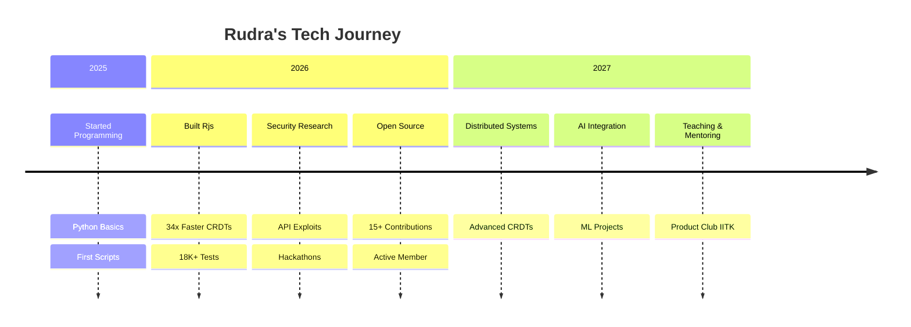

<div align="center">

<!-- ANIMATED HEADER -->


<!-- TYPING SVG -->
[](https://git.io/typing-svg)

<!-- BADGES ROW 1 -->
<p>
  
  
  
  
</p>

<!-- BADGES ROW 2 -->
<p>
  <a href="https://github.com/rudrakumar07?tab=repositories&sort=stargazers">
    
  </a>
  <a href="https://github.com/rudrakumar07/followers">
    
  </a>
  
  
  
</p>

<!-- SOCIALS -->
<p>
  <a href="mailto:rudrakumar25@iitk.ac.in"></a>
  <a href="https://instagram.com/rudra_kumar_68"></a>
  <a href="https://linkedin.com/in/rudrakumar07"></a>
  <a href="https://github.com/rudrakumar07"></a>
</p>

<!-- DIVIDER -->


</div>

---

##  About Me

<div align="center">

```yaml
name: "Rudra Kumar"
alias: "rudrakumar07"
location: "Mumbai, India 🇮🇳"
education: "B.Sc. Chemistry @ IIT Kanpur (2025-2029)"
role: "Full-Stack Developer & Security Researcher"

currently:
  learning: "Distributed Systems, CRDTs, Advanced Security"
  building: "Next-gen collaborative tools"
  exploring: "AI/ML integration in dev tools"
  reading: "Papers on conflict-free replicated data types"

interests:
  - 🔄 Real-Time Collaborative Systems (Google Docs/Figma style)
  - 🔒 Application Security & Exploit Discovery
  - 🧬 CRDTs & Distributed Computing
  - 🤖 AI/ML Tooling & Automation
  - 🌐 Open Source Development

superpowers:
  - "Building CRDT libraries 34x faster than Yjs"
  - "Finding API exploits in production systems"
  - "Turning newspapers into secret chat platforms"
  - "Making distributed systems simpler"

philosophy: "Build things that are fast, secure, and actually useful"
```

</div>

---

##  Featured Projects

<table>
  <tr>
    <td width="50%" valign="top">

### <a href="https://github.com/rudrakumar07/Rjs">⚡ Rjs</a> — High-Performance CRDT Library

> A drop-in alternative to Yjs with **34.9x faster** sequential inserts and **6.4x less** memory usage.

```
📊 Performance Comparison
━━━━━━━━━━━━━━━━━━━━━━━━━━━━━━━━
Sequential Inserts  │  34.9x faster
Memory Usage        │   6.4x smaller
Test Coverage       │  18,100+ tests
━━━━━━━━━━━━━━━━━━━━━━━━━━━━━━━━
```

- Built on block-wise RGA with packed numeric IDs
- Yjs-compatible binary encoding
- Handles concurrent edits, conflict resolution, undo/redo
- Drop-in replacement with zero config

`JavaScript` `CRDTs` `Performance` `18K+ Tests`

    </td>
    <td width="50%" valign="top">

### <a href="https://github.com/rudrakumar07/Techie-Picasso">🎨 Techie-Picasso</a> — Real-Time Collaborative Whiteboard

> Multiplayer drawing app with live cursors, stickers, and infinite canvas.

```
🎯 Features
━━━━━━━━━━━━━━━━━━━━━━━━━━━━━━━━
Live Cursors        │  ✅ Real-time
Comment Pins        │  ✅ Interactive
Stickers            │  ✅ Built-in
Multi-Server        │  ✅ Redis pub/sub
━━━━━━━━━━━━━━━━━━━━━━━━━━━━━━━━
```

- Real-time sync with Yjs CRDTs
- Multi-server support with Redis pub/sub
- Undo/redo, stickers, comment pins
- React + TypeScript + Docker

`TypeScript` `React` `Docker` `Redis`

    </td>
  </tr>
  <tr>
    <td width="50%" valign="top">

### <a href="https://github.com/rudrakumar07/deceiving-chatting-app">📰 The Daily Observer</a> — Secure Hidden Chat

> A newspaper with a hidden chat system — security meets creativity.

```
🛡️ Security Features
━━━━━━━━━━━━━━━━━━━━━━━━━━━━━━━━
Challenge-Response Auth │  ✅
SQLi Auto-Lockdown     │  ✅
XSS Protection         │  ✅
File Sharing           │  ✅
Admin Dashboard        │  ✅
━━━━━━━━━━━━━━━━━━━━━━━━━━━━━━━━
```

- Challenge-response authentication
- Auto-lockdown against SQLi/XSS
- File sharing & admin dashboard
- Built with Python + FastAPI + Redis

`Python` `FastAPI` `Security` `Redis`

    </td>
    <td width="50%" valign="top">

### <a href="https://github.com/rudrakumar07/Ethernet-Transfer">📡 Ethernet Transfer</a> — P2P File Transfer

> Compact peer-to-peer file transfer. Single EXE, no dependencies.

```
📦 Distribution
━━━━━━━━━━━━━━━━━━━━━━━━━━━━━━━━
Single EXE           │  ✅
No Python Required   │  ✅
MIT License          │  ✅
P2P Direct Link      │  ✅
━━━━━━━━━━━━━━━━━━━━━━━━━━━━━━━━
```

- Direct peer-to-peer transfer
- Single executable — no dependencies
- PyQt5 GUI with intuitive interface
- MIT Licensed

`Python` `PyQt5` `PyInstaller` `P2P`

    </td>
  </tr>
  <tr>
    <td width="50%" valign="top">

### <a href="https://github.com/rudrakumar07/FORGEDB">🗃️ FORGEDB</a> — Custom Database Engine

> A database engine built from scratch in C++.

```
🗄️ Components
━━━━━━━━━━━━━━━━━━━━━━━━━━━━━━━━
Storage Engine       │  Custom
Query Parser         │  Built-in
Indexing             │  B-Tree
Language             │  C++
━━━━━━━━━━━━━━━━━━━━━━━━━━━━━━━━
```

- Custom storage engine from scratch
- Learning how real databases work
- B-tree indexing implementation
- Low-level systems programming

`C++` `Database` `Systems` `Low-Level`

    </td>
    <td width="50%" valign="top">

### <a href="https://github.com/rudrakumar07/ML-paper-by-me">🧠 ML Paper</a> — Machine Learning Research

> Personal ML research and experimentation notebooks.

```
🔬 Research Areas
━━━━━━━━━━━━━━━━━━━━━━━━━━━━━━━━
Neural Networks      │  Exploring
Data Science         │  Active
Model Training       │  Ongoing
Jupyter Notebooks    │  ✅
━━━━━━━━━━━━━━━━━━━━━━━━━━━━━━━━
```

- ML model experimentation
- Data analysis pipelines
- Research paper implementations
- Jupyter-based workflow

`Python` `Jupyter` `ML` `Data Science`

    </td>
  </tr>
</table>

---

##  Tech Stack

<div align="center">

### 🎯 Languages


### 🎨 Frontend


### ⚙️ Backend & Real-Time


### 🛠️ DevOps & Tools


### 🔐 Security & AI


</div>

---

##  GitHub Metrics

<div align="center">

<!-- Lowlighter Metrics - Full -->
<a href="https://github.com/lowlighter/metrics">
  
</a>

<!-- Streak Stats -->


</div>

<br/>

<div align="center">

<!-- GitHub Stats Card -->


<!-- Top Languages -->


</div>

<br/>

<div align="center">

<!-- Trophies -->


</div>

<br/>

<div align="center">

<!-- Contribution Graph -->
<a href="https://github.com/ashutosh00710/github-readme-activity-graph">

</a>

</div>

---

##  Open Source Contributions

<div align="center">

> I actively contribute to open source projects I use and believe in.

</div>

<table>
  <tr>
    <td width="50%" valign="top">

**🐍 Python Ecosystem**
- [Textual](https://github.com/Textualize/textual) — Modern Python TUI framework
- [Falcon](https://github.com/falconry/falcon) — High-performance web API
- [Marshmallow](https://github.com/marshmallow-code/marshmallow) — Object serialization
- [SQLAlchemy](https://github.com/sqlalchemy/sqlalchemy) — Database toolkit
- [Flask-Admin](https://github.com/pallets-eco/flask-admin) — Admin interface
- [Click](https://github.com/pallets/click) — CLI toolkit
- [Attrs](https://github.com/python-attrs/attrs) — Python classes
- [Twine](https://github.com/pypa/twine) — PyPI utilities

    </td>
    <td width="50%" valign="top">

**🛠️ DevTools & Infrastructure**
- [HTTPie CLI](https://github.com/httpie/cli) — Modern HTTP client
- [Rich](https://github.com/Textualize/rich) — Terminal formatting
- [AgentKit](https://github.com/0xgasless/agentkit) — AI agent toolkit
- [Ultralytics YOLO](https://github.com/ultralytics/ultralytics) — Object detection
- [OpenCV](https://github.com/opencv/opencv) — Computer vision

**🏘️ Community**
- [Summer Projects 2026](https://github.com/pclubiitk/Summer-Projects-2026) — Product Club IITK

    </td>
  </tr>
</table>

<div align="center">


</div>

---

##  Currently Learning

<div align="center">

| 🎯 What | 📚 How | 🔥 Status |
|:---:|:---:|:---:|
| **Distributed Systems** | Papers & Building CRDTs | 🔥 Active |
| **Advanced Security** | Bug Bounties & CTFs | 🔥 Active |
| **AI/ML Integration** | Groq API & LLMs | 📖 Learning |
| **Rust** | Building systems tools | ⏳ Starting |

</div>

---

##  Achievements & Recognition

<div align="center">

<!-- Achievements from lowlighter/metrics -->
<a href="https://github.com/lowlighter/metrics">
  
</a>

<br/>

| 🏆 | Achievement | Description |
|:---:|:---|:---|
| 🦈 | **Pull Shark** | Merged multiple pull requests across repos |
| 🏅 | **GitHub Pro** | Powering up with advanced features |
| 🔥 | **Active Contributor** | Consistent open source activity |
| 🎯 | **Code Quality** | Maintaining high-quality code standards |
| 🌟 | **Star Gazer** | Earned stars for open source work |

</div>

---

##  Where I've Contributed

<div align="center">

<a href="https://github.com/Textualize/textual">
  
</a>
<a href="https://github.com/falconry/falcon">
  
</a>
<a href="https://github.com/sqlalchemy/sqlalchemy">
  
</a>
<a href="https://github.com/httpie/cli">
  
</a>
<a href="https://github.com/ultralytics/ultralytics">
  
</a>
<a href="https://github.com/opencv/opencv">
  
</a>
<a href="https://github.com/pallets/click">
  
</a>
<a href="https://github.com/Textualize/rich">
  
</a>

</div>

---

##  What I'm Thinking About

<div align="center">

> 🧠 *"Real-time collaboration, CRDTs, and how to make distributed systems simpler."*

</div>

<div align="center">

```python
class RudraKumar:
    """A chemistry undergrad who codes more than he studies."""
    
    def __init__(self):
        self.name = "Rudra Kumar"
        self.role = "B.Sc. Chemistry @ IIT Kanpur"
        self.location = "Mumbai, India"
        self.github = "rudrakumar07"
        
        # Passions
        self.passions = [
            "CRDTs", "Distributed Systems", "Security",
            "Open Source", "Building Fast Things"
        ]
        
        # Current obsessions
        self.obsessions = {
            "primary": "Building CRDT libraries 34x faster than Yjs",
            "secondary": "Finding API exploits in production systems",
            "tertiary": "Making distributed systems simpler"
        }
        
        # Fun facts
        self.fun_facts = [
            "Built a chat app disguised as a newspaper",
            "Found API exploits organizers missed",
            "Codes more than studies (but still passes)"
        ]
    
    def current_project(self):
        return "Rjs - A CRDT library that's stupidly fast"
    
    def philosophy(self):
        return "Build things that are fast, secure, and actually useful"
    
    def __repr__(self):
        return f"RudraKumar('{self.name}', passions={self.passions})"

# Usage
rudra = RudraKumar()
print(f"Building: {rudra.current_project()}")
print(f"Thinking: {rudra.philosophy()}")
```

</div>

---

##  Random Dev Quote

<div align="center">

[](https://github.com/piyushsuthar/github-readme-quotes)

</div>

---

##  Tech Journey Timeline

<div align="center">



</div>

---

##  Quick Links

<div align="center">

| 🔗 Link | 📝 Description |
|:---:|:---|
| [📧 Email](mailto:rudrakumar25@iitk.ac.in) | Drop me a message |
| [📸 Instagram](https://instagram.com/rudra_kumar_68) | Follow my life |
| [💼 LinkedIn](https://linkedin.com/in/rudrakumar07) | Professional connect |
| [🐙 GitHub](https://github.com/rudrakumar07) | Check my code |
| [📰 Blog](https://github.com/rudrakumar07#) | Tech insights |

</div>

---

##  Let's Connect!

<div align="center">

[](mailto:rudrakumar25@iitk.ac.in)
[](https://github.com/rudrakumar07)
[](https://instagram.com/rudra_kumar_68)
[](https://linkedin.com/in/rudrakumar07)

</div>

<br/>

<div align="center">

### 💡 Interested in collaborating?

> I'm always open to interesting projects, especially in **distributed systems**, **security**, and **open source**.
> Feel free to reach out — I respond to emails and DMs!

</div>

<br/>

<div align="center">

<!-- Waving hand footer -->


</div>

---

<div align="center">


**⚡ Keep building. Keep shipping. Keep learning. ⚡**

<!-- FUN FOOTER BADGE -->


</div>
